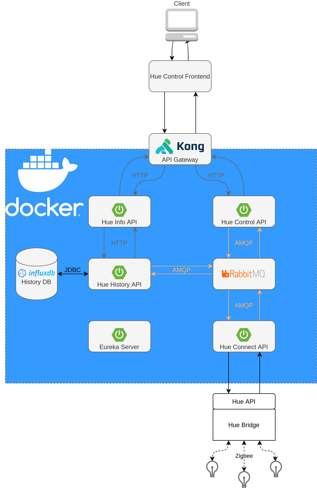

# hue-connect

Eine Webapplikation, um den Status von Hue Geräten abzufragen und zu setzen.

## Komponenten

* [Eureka Server](#eureka-server)
* [Hue Connect API](#hue-connect-api)
* [Hue History API](#hue-history-api)
* [Hue Info API](#hue-info-api)
* [Hue Control API](#hue-control-api)
* [Hue Control Frontend](#hue-control-frontend)

### Eureka Server
To Do...

### Hue Connect API
To Do...

### Hue History API
To Do...

### Hue Info API
To Do...

### Hue Control API
To Do...

### Hue Control Frontend
To Do...

## Verwendete Technologien:
* [Spring Boot]
* [Docker]
* [RabbitMQ]
* [InfluxDB]
* [Bootstrap]
* [Swagger]
* [kong API Gateway]
